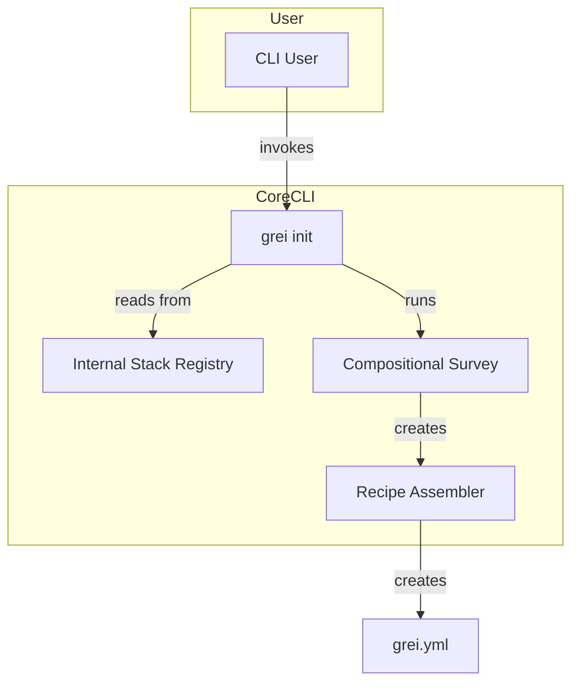

# 📘 System Patterns — GRX CLI

## 1. Architecture Overview
The GRX CLI is designed using a **Compositional Internal Stack Architecture** built on the principles of **Hexagonal Architecture (Ports and Adapters)**. This ensures a clear separation between the core CLI logic and the various built-in technology stacks it supports.

### The "Project Composer" Model
The `grei init` command acts as a "Project Composer." It guides the user through a series of questions to compose their project's recipe by selecting from different categories of pre-defined, built-in stacks.

## 2. The `init` Command Workflow
The initialization process follows a clear, multi-phase approach:

1.  **Discovery:** The `grei init` command starts by reading the `stack.Registry` to find all available built-in stacks.
2.  **Composition:** The core CLI presents the user with a series of high-level questions, one for each stack category (e.g., "Select a Code Stack," "Select a Persistence Stack"). The options for each question are dynamically populated from the internal registry.
3.  **Assembly:** The user's selections are gathered, and the `Recipe Assembler` merges them into a single, comprehensive `grei.yml` file.

## 3. Key Technical Decisions
- **Single Binary:** All stacks are defined directly within the Go binary. There is no external plugin system. This simplifies distribution and ensures that the tool's capabilities are always consistent and self-contained.
- **Composition over Inheritance:** This model allows users to compose their ideal project stack by mixing and matching best-of-breed internal stacks, rather than being locked into a single, monolithic stack.
- **Extensibility through Contribution:** To add a new stack, a developer must add a new entry to the internal `stack.Registry` and submit a pull request. This ensures that all available stacks are centrally managed and vetted according to Greicodex standards.
